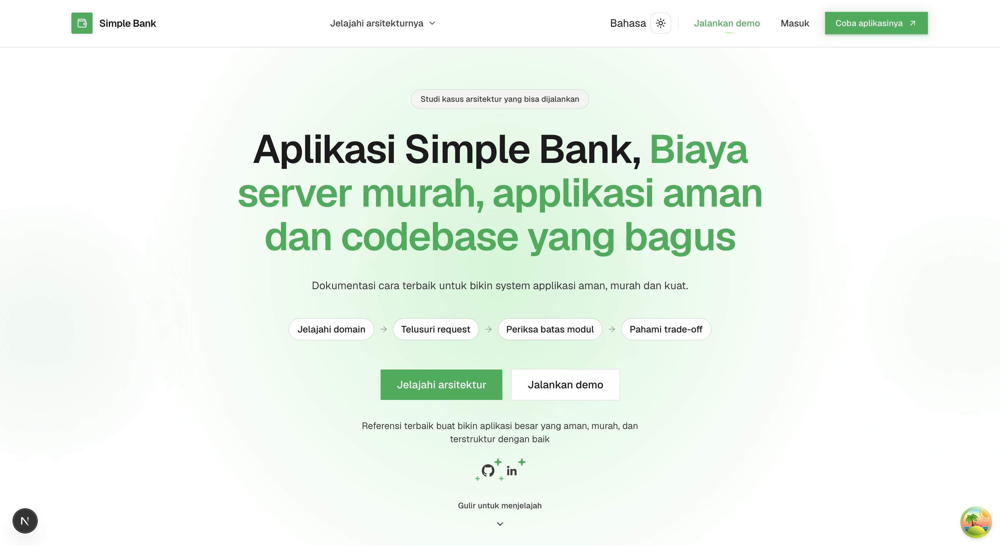

<h3 align="left">Languages and Tools:</h3>

<p align="left">
  <a href="https://react.dev/" target="_blank" rel="noreferrer">
    
  </a>
  <a href="https://nextjs.org/" target="_blank" rel="noreferrer">
    
  </a>
  <a href="https://www.typescriptlang.org/" target="_blank" rel="noreferrer">
    
  </a>
  <a href="https://tailwindcss.com/" target="_blank" rel="noreferrer">
    
  </a>
  <a href="https://ui.shadcn.com/" target="_blank" rel="noreferrer">
    
  </a>
  <a href="https://go.dev/" target="_blank" rel="noreferrer">
    
  </a>
  <a href="https://gin-gonic.com/" target="_blank" rel="noreferrer">
    
  </a>
  <a href="https://sqlc.dev/" target="_blank" rel="noreferrer">
    
  </a>
  <a href="https://www.postgresql.org/" target="_blank" rel="noreferrer">
    
  </a>
  <a href="https://github.com/golang-migrate/migrate" target="_blank" rel="noreferrer">
    
  </a>
  <a href="https://www.docker.com/" target="_blank" rel="noreferrer">
    
  </a>
  <a href="https://docs.docker.com/compose/" target="_blank" rel="noreferrer">
    
  </a>
  <a href="https://www.nginx.com/" target="_blank" rel="noreferrer">
    
  </a>
  <a href="https://www.terraform.io/" target="_blank" rel="noreferrer">
    
  </a>
  <a href="https://aws.amazon.com/" target="_blank" rel="noreferrer">
    
  </a>
  <a href="https://aws.amazon.com/ec2/" target="_blank" rel="noreferrer">
    
  </a>
  <a href="https://vercel.com/" target="_blank" rel="noreferrer">
    
  </a>
</p>

**Frontend:** React · Next.js · TypeScript · Tailwind · shadcn/ui · Vercel

**Backend:** Go · Gin · sqlc · PostgreSQL · golang-migrate

**Infrastructure:** Docker · Docker Compose · Nginx · Terraform · AWS · EC2

# Simple Bank

Simple Bank is a working banking domain built as an **architecture and
engineering reference project**. It lets a user create accounts, view
balances, make deposits, transfer money, and review account history while
making the design decisions behind those workflows visible.

The target audience is a developer with roughly **one or more years of
programming experience** who wants to study how a frontend, HTTP service,
database, tests, containers, and deployment configuration fit together.

This is a **prototype and learning project**, not a financial institution or a
place to store real money. Its purpose is to demonstrate clear boundaries,
careful money movement, useful security controls, and a practical computing
footprint.

## What can you do?

### Create a profile and sign in

New users can create a profile with a username and email address. Returning
users can sign in with their email address and access their private accounts.
The application keeps each user's accounts and activity separate from other
users.

### Manage multiple accounts

Users can create more than one account, give each account a name and optional
description, and see its account number, balance, currency, and creation date.
One account can be marked as the main account for easier organization.

From the account list, users can:

- Search their accounts by name.
- Open an account to see its details.
- Edit an account's name or description.
- Delete an account when it is no longer needed.

When a non-main account is deleted, its remaining balance is moved to the main
account first so the money is not silently lost.

### Add money with a deposit

Users can choose an account and record a deposit. The new balance is shown in
the account and the deposit becomes part of that account's activity history.

### Transfer money between accounts

Users can send money from one account to another. The transfer flow helps the
user choose the source account, find a destination by account number, review
the transfer details, and confirm the transaction.

The application updates both accounts together and records the movement on
each side of the transfer.

### Review account activity

Each account has a history of balance changes. Users can review entries such
as deposits and transfers, including the amount and the balance before and
after the activity. Recently used transfer destinations are also available to
make repeated transfers easier.

### Follow a guided first-time journey

The onboarding flow walks a new user through the main experience:

1. Create an account.
2. Add money with a deposit.
3. Transfer money between accounts.

This gives someone a clear way to explore the application without having to
learn the whole interface first.

### Choose a comfortable interface

The portal is available in **English and Indonesian**. Users can also choose a
light, dark, or system-based appearance. The layout is designed to work on
different screen sizes, with the main actions available from the account
sidebar.

## A typical experience

1. Register with a username and email address.
2. Create a named account, such as "Everyday Spending".
3. Deposit an amount to give the account a balance.
4. Create another account, such as "Savings".
5. Transfer money between the two accounts.
6. Open either account to review its balance and activity history.

## Why this project exists

Simple Bank explores how to build a complete application with clear
responsibilities, dependable money movement, and infrastructure that remains
affordable to operate. The banking workflow is the example domain; the main
subject is the engineering structure behind it.

The project is intended to be:

- A practical demonstration of modern application design.
- A reference for building clean and maintainable software.
- A place to practice frontend, backend, database, deployment, and CI/CD
  patterns together.
- A foundation that can grow into more advanced banking features over time.

## How it works behind the scenes

The application has two main parts:

- A web portal where users create profiles, manage accounts, and perform
  transactions.
- A Go service that authenticates users, stores account data, and applies
  ledger-based rules whenever balances change.

Every deposit and transfer is recorded as an account entry. This gives the
application a clear history of how each balance was produced instead of only
keeping the latest number.

The project uses Next.js for the web portal, Go for the service layer, and
PostgreSQL for persistent data. Docker, migrations, automated checks, and
deployment configuration are included to make the system easier to run and
extend.

## Architecture at a glance

The repository is a small monorepo with a Next.js portal and a Go core
service. The portal does not connect directly to PostgreSQL. It calls the Go
API, which owns authentication, authorization, business rules, transactions,
and database access.

```text
Browser
  |
  v
Next.js portal
  app/ pages and layouts
  components/ presentation and forms
  feature/ typed clients, hooks, schemas, and domain types
  lib/api/ shared Axios client and request interceptor
  |
  | HTTP JSON API
  v
Nginx reverse proxy and rate limiter
  |
  v
Go core service
  internal/api/ HTTP handlers and middleware
  internal/db/store/ business logic and database transactions
  internal/db/sqlc/ generated type-safe query layer
  |
  v
PostgreSQL
```

The main ownership rule is simple: the portal coordinates user interaction,
but the core service is authoritative for account ownership, balance rules,
and money movement.

## Technology stack

### Frontend: Next.js and React

The portal lives in [apps/portal](apps/portal) and uses:

| Technology            | Version                  | Responsibility                                                        |
| --------------------- | ------------------------ | --------------------------------------------------------------------- |
| Next.js               | 16.3.3                   | App Router, layouts, server components, metadata, and the web runtime |
| React                 | 19.2.8                   | Component rendering and interactive UI                                |
| TypeScript            | 5.x                      | Static typing for components, API clients, hooks, and domain data     |
| Tailwind CSS          | 4.x                      | Utility-based styling                                                 |
| shadcn/ui and Base UI | shadcn 4.19, Base UI 1.7 | Reusable UI primitives owned by the project                           |
| Motion                | 13.2                     | Page and interaction animation                                        |
| Axios                 | 1.20                     | Shared HTTP client for the Go API                                     |

The frontend is organized by feature. For example, account code is grouped
under `feature/account`, while account creation and transfer dialogs live in
their related component folders.

### Frontend state, forms, and data fetching

| Technology                  | Responsibility                                                                       |
| --------------------------- | ------------------------------------------------------------------------------------ |
| TanStack Query 5            | Server-state caching, query invalidation, mutations, and server-side prefetching     |
| Zustand 5                   | Local state for multi-step dialogs such as account creation, deposits, and transfers |
| React Hook Form 7           | Form state, submission, and field-level errors                                       |
| Zod 3                       | Runtime validation schemas for form workflows                                        |
| `@hookform/resolvers`       | Connects Zod schemas to React Hook Form                                              |
| `react-i18next` and i18next | English and Indonesian translations                                                  |
| next-themes                 | Light, dark, and system theme selection                                              |
| Winston                     | Structured, PII-redacting logging utilities                                          |

The portal follows this data path:

1. A page can prefetch data with TanStack Query on the server.
2. A feature hook reads or mutates that data in a client component.
3. A feature client calls the shared Axios instance.
4. The API interceptor adds authentication and timezone headers, logs the
   request, and handles unauthorized responses.
5. The Go service performs the authoritative validation and business decision.

### Backend: Go HTTP service

The core service lives in [apps/core-service](apps/core-service) and uses Go
1.25.0 with these main libraries:

| Technology            | Version          | Responsibility                                   |
| --------------------- | ---------------- | ------------------------------------------------ |
| Go                    | 1.25.0           | Service implementation and concurrency model     |
| Gin                   | 1.12.0           | HTTP routing, middleware, and handlers           |
| `validator/v10`       | 10.30.1          | Request validation                               |
| `golang-jwt/jwt/v5`   | 5.3.1            | Stateless access-token creation and verification |
| Viper                 | 1.21.0           | Environment and application configuration        |
| `log/slog`            | Standard library | Structured service logging                       |
| `shopspring/decimal`  | 1.4.0            | Exact decimal arithmetic for money               |
| `golang.org/x/crypto` | 0.48.0           | Cryptographic support                            |
| Gin CORS              | 1.7.7            | Controlled browser-origin access                 |

The service is split into focused layers:

- `internal/api`: HTTP handlers, response mapping, authentication
  middleware, request IDs, and error handling.
- `internal/db/store`: business rules and multi-step database transactions.
- `internal/db/sqlc`: generated query methods and database types. Generated
  files should not be edited by hand.
- `internal/token`: token creation and payload verification.
- `internal/config`: configuration loading through Viper.
- `internal/logger`: construction of the structured logger.
- `internal/domain`: shared domain constants and types.

A handler translates HTTP input and output, the store decides what the
operation means, and SQLC executes the query. Keeping those responsibilities
separate makes each layer easier to test and replace.

### Database and persistence

| Technology      | Responsibility                                                        |
| --------------- | --------------------------------------------------------------------- |
| PostgreSQL 16   | Relational storage for users, accounts, transfers, and ledger entries |
| `lib/pq` 1.12.3 | PostgreSQL driver                                                     |
| sqlc            | Generates type-safe Go code from SQL without introducing an ORM       |
| golang-migrate  | Versioned up/down database migrations                                 |

Money values are represented as strings at the API and database boundary and
parsed with `shopspring/decimal` in the service. This avoids binary
floating-point errors.

Transfers use database transactions and deterministic account locking. The
operation either updates the required balances and ledger records together or
rolls back. Ledger records explain how a balance was produced instead of only
storing the latest number.

### Testing and generated documentation

The core service uses Go's testing package, Testify, generated
`go.uber.org/mock` mocks, and a real PostgreSQL container for integration
tests. Swagger annotations and `swaggo` generate OpenAPI documentation.

The portal currently has lint, TypeScript, and production-build checks, but no
configured Vitest or Jest test suite. See [apps/portal/README.md](apps/portal/README.md)
for the current verification commands.

### Infrastructure and deployment

Docker packages the core service and local dependencies. Docker Compose runs
PostgreSQL, the core service, and Nginx together. Nginx acts as the public
reverse proxy and an additional rate-limiting boundary; the core service is
not published directly in the Compose setup.

Terraform provisions the deployment configuration for a single AWS EC2
instance. GitHub Actions and deployment scripts provide a path for checks,
image publishing, and redeployment. PostgreSQL data is stored in a named
Docker volume for local development.

This is a cost-conscious design, not a claim that a single EC2 instance is a
complete production banking platform. The purpose is to make the trade-offs
clear and provide a foundation that can expand when scale or availability
requirements change.

Technical orientation and local setup instructions are available in the
[core service README](apps/core-service/README.md) and [portal README](apps/portal/README.md).

## Getting started

### Prerequisites

- Go 1.25 or newer.
- Node.js compatible with Next.js 16.
- Yarn 1.22.22 for the portal.
- Docker and Docker Compose.
- PostgreSQL is supplied by Docker for local development.

### Run the backend

```bash
cd apps/core-service
cp app.env.example app.env
# Review the values in app.env, especially database and JWT settings.
make db-up
make server
```

### Run the portal

In another terminal:

```bash
cd apps/portal
yarn install
yarn dev
```

Open `http://localhost:3000`. The portal uses
`http://localhost:8080/api/v1` as its default API URL unless
`NEXT_PUBLIC_API_URL` is set in `.env.local`.

### Run checks

For the backend:

```bash
cd apps/core-service
make test
```

For the portal:

```bash
cd apps/portal
yarn lint
yarn tsc --noEmit
yarn build
```

## Engineering topics worth studying

If you are learning from this repository, useful paths to trace are:

1. Follow a transfer from the portal feature to the Go route, store
   transaction, SQL queries, and query invalidation.
2. Compare frontend validation with backend validation. Client feedback is
   useful, but the service must remain authoritative.
3. Read how account locks are acquired in a deterministic order to reduce
   deadlock risk.
4. Inspect how a balance change produces ledger history rather than only a
   new balance value.
5. Compare generated SQLC code with the handwritten SQL in
   `apps/core-service/internal/db/query`.
6. Trace configuration from environment files through Go and Docker Compose.
7. Review the security documentation and documented limitations before
   treating the prototype as a production design.

## Important note

Simple Bank is for demonstration and learning. It is not connected to a
financial institution, does not process real payments, and should not be used
with real financial information or real money.
