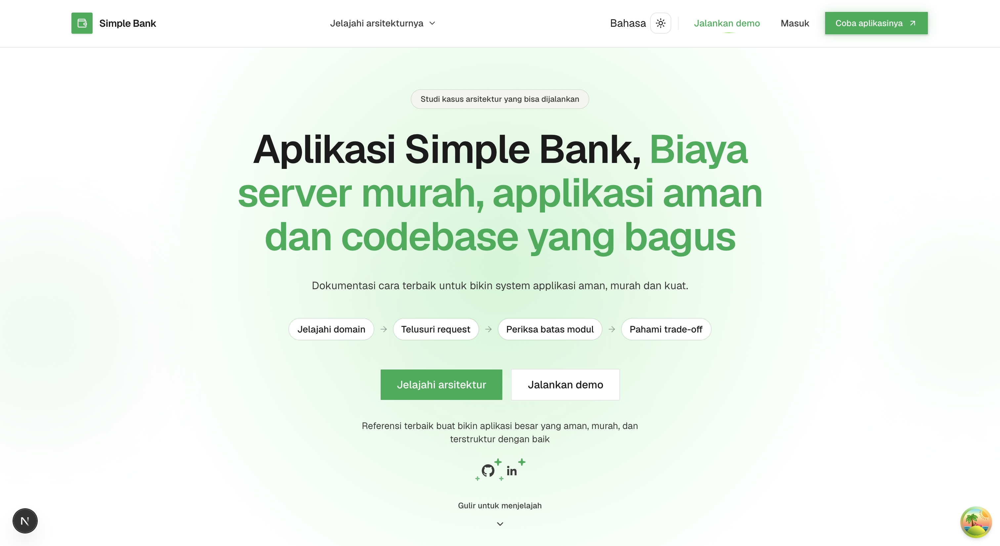

## Author

[Dewa Surya Ariesta](mailto:sdewa6646@gmail.com)

# Simple Bank

A small banking app built as an **architecture and engineering reference**.
Create accounts, deposit money, transfer between accounts, and review
history, with the design decisions behind each workflow kept visible.

> This is a learning project. It does not process real payments and must not
> be used with real money or real financial information.

## Tech stack

| Layer          | Tools                                                                              |
| -------------- | ---------------------------------------------------------------------------------- |
| Frontend       | Next.js 16, React 19, TypeScript, Tailwind CSS, shadcn/ui, TanStack Query, Zustand |
| Backend        | Go 1.25, Gin, sqlc, `shopspring/decimal`, JWT                                      |
| Database       | PostgreSQL 16, golang-migrate                                                      |
| Infrastructure | Docker, Docker Compose, Nginx, Terraform, AWS EC2, Vercel                          |

## Features

- Register and sign in with email
- Create multiple accounts, with one marked as main
- Deposit money and transfer between accounts
- View each account's ledger history (balance before and after every change)
- Guided onboarding for first-time users
- English and Indonesian, with light and dark themes

## Architecture

```text
Browser
  -> Next.js portal        (apps/portal)
  -> Nginx                 (reverse proxy + rate limiting)
  -> Go core service       (apps/core-service)
       internal/api        HTTP handlers and middleware
       internal/db/store   business logic and transactions
       internal/db/sqlc    generated type-safe queries
  -> PostgreSQL
```

The portal never talks to the database directly. The Go service is the
single source of truth for authentication, account ownership, and money
movement.

Key design choices:

- **Ledger-based balances:** every deposit and transfer writes an entry, so
  each balance can be traced back to its history.
- **Safe transfers:** both accounts update in a single database transaction,
  with locks taken in a fixed order to avoid deadlocks.
- **Exact money math:** amounts are strings at the boundaries and
  `decimal` values in Go, never floats.

## Getting started

**Prerequisites:** Go 1.25+, Node.js (compatible with Next.js 16), Yarn
1.22, Docker.

Start the backend:

```bash
cd apps/core-service
cp app.env.example app.env   # review DB and JWT settings
make db-up
make server
```

Start the portal in another terminal:

```bash
cd apps/portal
yarn install
yarn dev
```

Open http://localhost:3000. The portal calls `http://localhost:8080/api/v1`
by default; set `NEXT_PUBLIC_API_URL` in `.env.local` to change it.

## Checks

```bash
# Backend
cd apps/core-service && make test

# Portal
cd apps/portal && yarn lint && yarn tsc --noEmit && yarn build
```

## Learn more

- [Core service README](apps/core-service/README.md)
- [Portal README](apps/portal/README.md)

Good paths to trace if you're studying the code:

1. A transfer from the portal, through the Go route and store transaction,
   down to the SQL queries.
2. How account locks are ordered to prevent deadlocks.
3. Handwritten SQL in `apps/core-service/internal/db/query` compared with the
   generated sqlc code.
