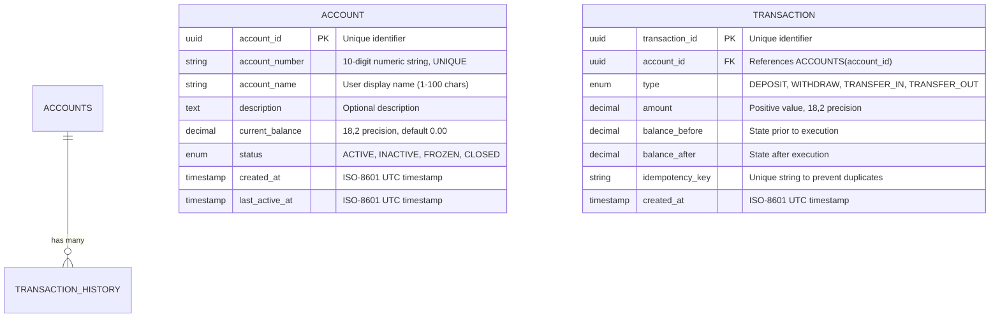

# Simple bank system 

## Product summary 

Core banking application,
- Managing account
- enforces strict ledger-based balance adjustments
- process account to account transfers

## Account Management scop 

system must maintain account state using the following schema fields: 

| Field Name  | Type         | Rules And Constraints | 
| ---         | ---          | ---                   | 
| `id`        | UUID         | Unique, Primary Key   | 
| `number`    | String       | Generated by System, Unique, Read-only, Indexed | 
| `desc`      | Text         | Optional              | 
| `balance`   | Decimal      | 18 digits decimal, with default 0.00 | 
| `status`    | Varchar      | value can be `active` or `inactive` | 
| `created_at`| Timestamp    | Timestamp set at creation | 
| `updated_at`| Timestamp    | Set every transaction     | 

### Lifecycle and Status Rules

- Activation: account need to be active in order to do transaction 
- Every transaction, should update fields `updated_at`
- Inactive account will handle soon 

## Ledger and Balance Updates

Every Ledger event must permanently write an immutable record to the `transaction_history` table containing: 

- `id` : UUID 
- `account_id`: foreign key referencing the target account 
- `type` : "Deposit,Withdraw,Transfer_in,Transfer_out"
- `amount` : Positive decimal value 
- `balance_before` : Account balance prior to transaction execution 
- `balance_after` : Account balance immediately after transaction execution 
- `created_at` : Timestamp 

